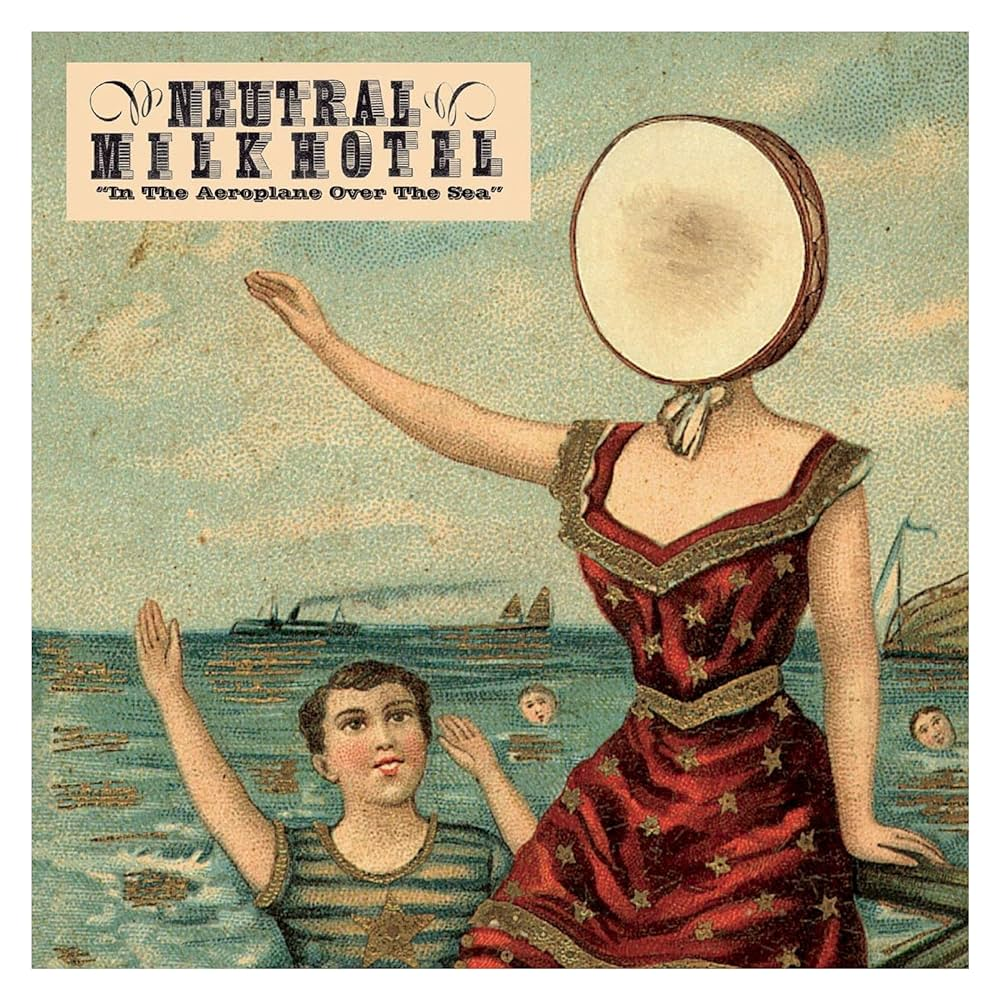

I've recently refactored things in this SSG slightly to make working with images easier, and what better way to test that than to make a list of my favorite albums? With, like, album covers and stuff?
<!-- more -->
## Joanna Newsom – _Ys_ (2006)

Years ago (2007?), my wife let out a pained grunt. "Look, everyone's telling me to listen to this album, but I just can't." She showed me the album cover, which looked like a woman being held hostage at a renaissance fair. "And look at these song titles: 'Monkey & Bear'? And if you listen –" and here she played for me the first few seconds of the first track, which began with a pained, raspy squeak about birds - "it's... I just can't."

I didn't listen to it right away. It wasn't until around 2020 or so that I actually went back and said, okay, fine, I'll listen to the precious ren-fair woman. And it took me several listens to actually get it, but now it's one of my two favorite albums; it's always a tossup between this album and the next, but currently this one is winning. Perhaps because I've listened to it more recently.

 

## Neutral Milk Hotel - _In the Aeroplane, Over the Sea_ (1998)

This was another acquired taste; with a few exceptions, most of my favorite albums are acquired tastes, and generally for the same reason, namely unorthodox vocals.

