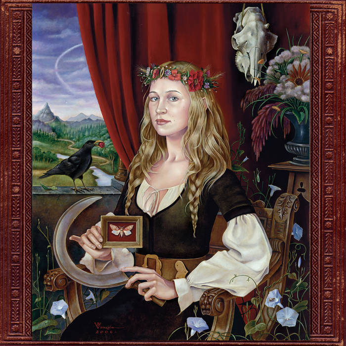
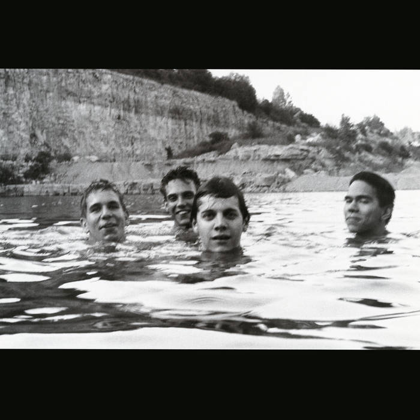

I've recently refactored things in this SSG slightly to make working with images easier, and what better way to test that than to talk about a couple albums I like? With, like, album covers and stuff?
<!-- more -->
## Joanna Newsom – _Ys_ (2006)

Years ago (2007?), my wife let out a pained grunt. "Look, everyone's telling me to listen to this album, but I just can't." She showed me the album cover, which looked like a woman being held hostage at a renaissance festival. "And look at these song titles: 'Monkey & Bear'? And if you listen –" and here she played for me the first few seconds of the first track, which began with a pained, raspy squeak about birds - "it's... I just can't."

I didn't listen to it right away. It wasn't until around 2020 or so that I actually went back and said, okay, fine, I'll listen to the precious ren-faire woman. And it took me several listens to actually get it, but now it's one of my two favorite albums; it's always a tossup between this album and the next, but currently this one is winning. Perhaps because I've listened to it more recently.

My path to adoration came via the lyrics. I normally don't pay a tremendous amount of attention to lyrics. I think they're important, as important as anything, but for whatever reason, it takes my brain a while to understand them. And Joanna's lyrics are fantastic, but they're not necessarily _direct_; she uses a lot of metaphor, a lot of imagery that it would seem is specific to her alone, etc. So while I may pick out a clever turn of phrase here and there, I have to build an understanding of each song gradually, essentially using every line as context for every other line.

As I started understanding the lyrics more, the structure of the songs fell into place. Rather than a directionless jumble, I started seeing the progression and the shape. Yes, I admit to some disorientation when a song doesn't follow a verse-chorus-verse format. It takes me some time to understand _why_ it's departing from that form, and I implicitly expect the form to be justified.

And after the structure of the songs, the instrumentation and arrangements made sense. And, finally, Joanna's untutored warbles and squeaks and sobs. Her voice is painfully human – anguished, confused, wounded, amused, irritated – and she's wandering clumsily through a grander setting. It makes me think of _Alice's Adventures in Wonderland_. Or, simply, to be a thinking, feeling creature.

 

## Neutral Milk Hotel - _In the Aeroplane, Over the Sea_ (1998)

This was another acquired taste; with a few exceptions, most of my favorite albums are acquired tastes, and generally for the same reason, namely unorthodox vocals.

There may be another reason this album is an acquired taste: the Anne Frank thing is a little weird.

What I love about this album, though, is that Jeff Mangum seems to be entirely open about the weirdness and leaves us to sort it out. He doesn't lean in and start making everything aggressively weird, nor does he lampshade it and say "ha ha guys, I know this thing with lucid dreaming about conversations with Anne Frank is a little weird, but, y'know, ART." It feels like an honest and fairly direct expression of his feelings.

And I _like_ his feelings: grief, anguish, guilt, compassion, righteous anger, and more. So many emotions come out over the course of this album. And, rather than coming across like a grocery list of themes and sentiments, they seem like a reckless tumult, unable to extract themselves from one another.

 

## Slint - _Spiderland_ (1991)

Perhaps the top of the "unorthodox vocals" list: Brian McMahan just cannot sing, though he does his best.

But this album clicks on a very personal level. "Breadcrumb Trail" reminds me of an experience I had – or, more accurately, _didn't_ have – going to a carnival alone when I was 14 or 15. "Don, Aman" is like a summary of all of my experiences as a deeply introverted person going to parties and bars in high school, college, and the Navy. "Washer" blends a juvenile earnestness and almost histrionic emotional openness with a subtler, more adult feeling of isolation and hopelessness. "Nosferatu Man" blends post-hardcore with math rock and angularly progressive punk. "For Dinner..." is self-consciously directionless, I think, which belies the fact that it's actually quite well-controlled.

I had to struggle to use "juvenile" only once in the paragraph above; the truth is that it describes every song. I don't mean that negatively (although "Washer" can grate on me a bit; more on that later). The lyrics seem like what they are: things written in a hurry by young men on the verge of adulthood, in unstable circumstances, doing what they loved but not with tremendous popular success. It reminds me of trying to write and record songs in high school and college. There's a fumbling, raw nature, filling out the earnestness.

The twist, though, is that the music is precocious. It's not only complex, with changing time signatures and novel structures, but it also shows restraint and sensitivity and a sophisticated musicianship. The band plays together very well, which then lends a depth and richness to the unpolished, earnest nature of the lyrics and their subject matter.

The last song, "Good Morning, Captain", is my favorite. I've neglected mentioning it thusfar because of how much of a standout I believe it is. I think Brian's vocals, however crude, are a perfect match for the music. I can't imagine anyone performing (I hesitate to say "singing") this song any better.

The lyrics are unique and impressive to me too; they're deceptive, I think, in such a way that in sections you can't really tell which of the two characters is the subject.

My interpretation of the song is that in the shipwreck, the captain died... but the single spirit formed two ghosts, the captain and the little boy. The captain's ghost is burdened with an old man's regrets and a professional's failures. The boy's ghost is burdened with unfulfilled promise, primal fear, and loneliness. Each ghost haunts the other. They are repelled and horrified by one another, but share an unbearable longing to reconcile.

 
